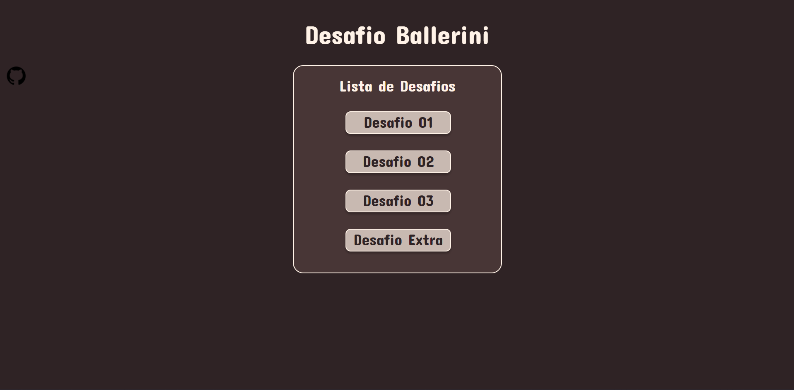
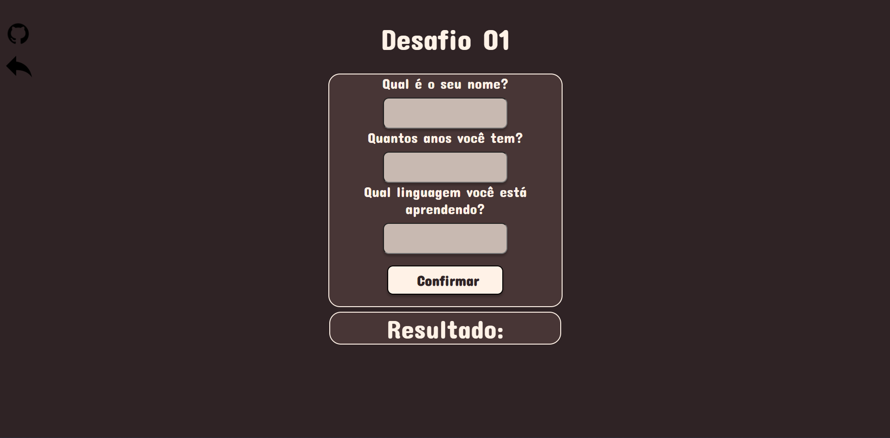
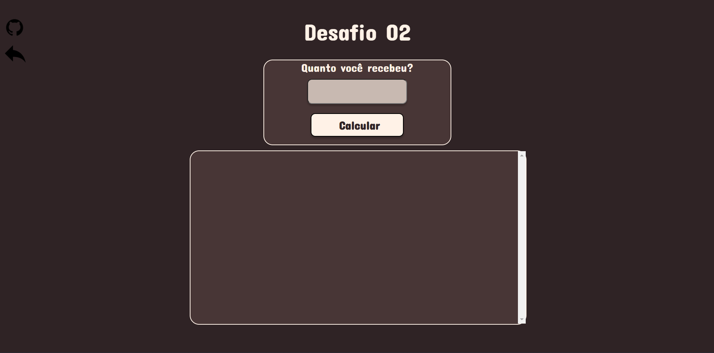
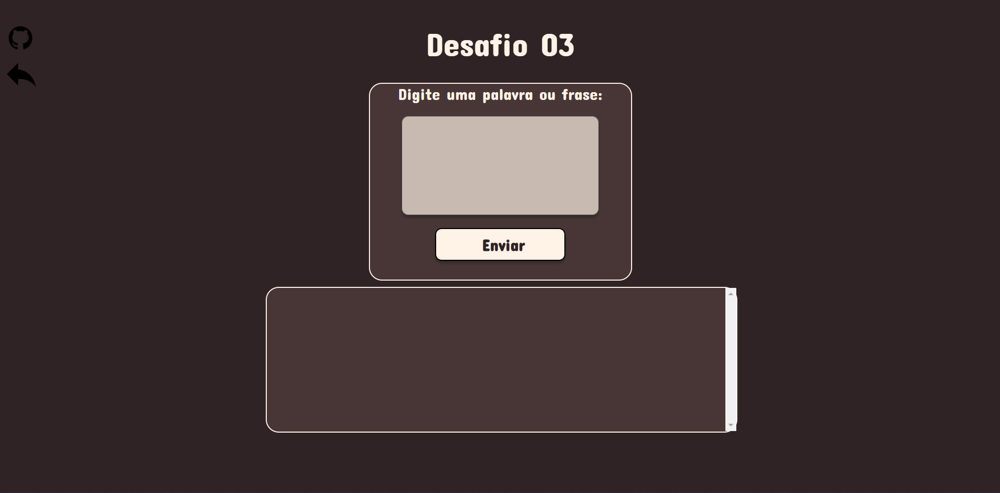
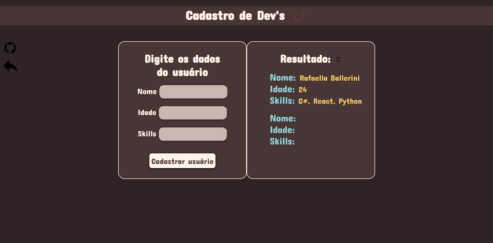

# Desafio Ballerini

Este projeto foi um desafio proposto pela comunidade da Rafaella Ballerini. 
Neste projeto foi usado HTML, CSS e JS.  

O objetivo do desafio era criar um menu, onde o usuário clicaria sobre um dos desafios,  
assim que o usuário clicasse, isso o levaria a outra página, onde teria pequenas interações.

Recomendo a todos a seguirem a Rafaella Ballerini em suas redes socias,  e em sua comunidade do Discord, pois ela está sempre 
a promover desafios  que ampliam seus conhecimentos.

 Link's 
  <a href="https://www.youtube.com/c/rafaellaballerini/community" target="_blank">YouTube - Rafa Ballerini</a> 
  <a href="https://www.instagram.com/rafaballerini/" target="_blank">Instagram - Rafa Ballerini</a> 
  <a href="https://discord.com/invite/wagxzStdcR" target="_blank">Comunidade do Discord</a>
  

  
  
  
  
  
  
